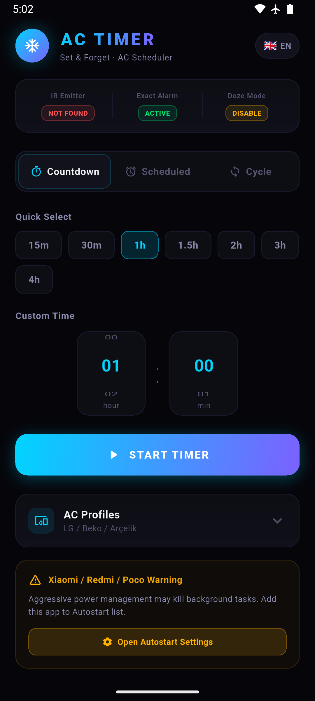
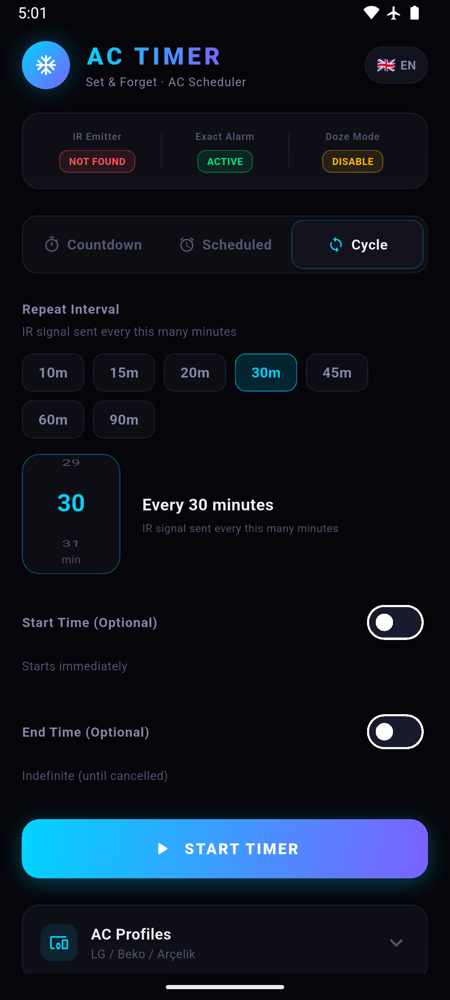
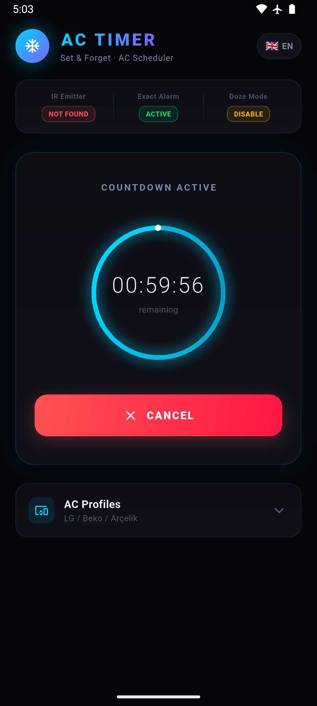
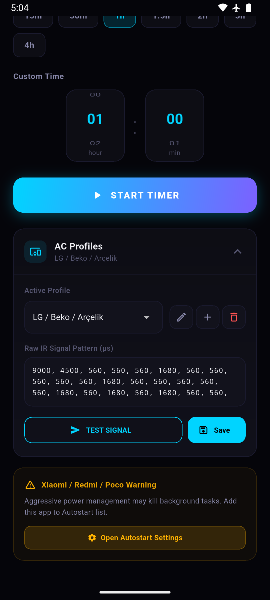
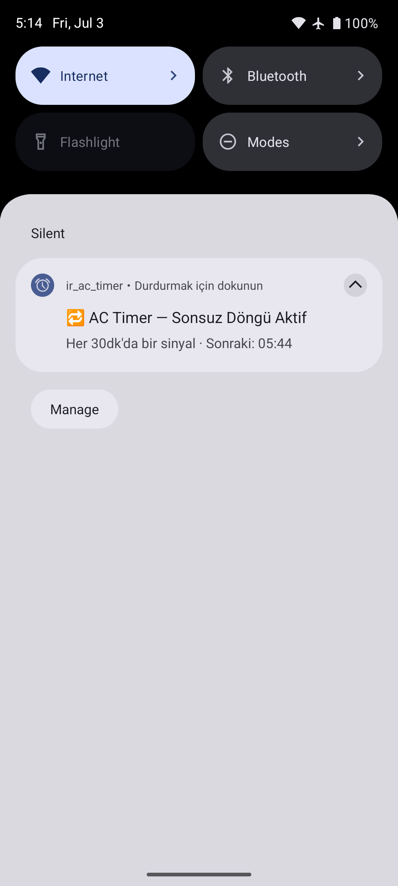

# IR AC Timer

<div align="center">

**[🇹🇷 Türkçe](#türkçe) | [🇬🇧 English](#english)**

> **Ayarla & Unut / Set & Forget** — Kızılötesi vericili Android cihazlar için hafif, güvenilir klima kapatma zamanlayıcısı.  
> Lightweight, reliable AC shutdown timer for Android devices with infrared (IR) emitters.

[](https://flutter.dev)
[](https://developer.android.com)
[](LICENSE)

</div>

---

<a name="türkçe"></a>
# 🇹🇷 Türkçe Dokümantasyon

## İçindekiler (TR)
- [Genel Bakış](#genel-bakış)
- [Ekran Görüntüleri](#ekran-görüntüleri)
- [Özellikler](#özellikler)
- [Nasıl Çalışır](#nasıl-çalışır)
- [Gereksinimler](#gereksinimler)
- [Kurulum ve Derleme](#kurulum-ve-derleme)
- [Zamanlama Modları](#zamanlama-modları)
- [Klima Profilleri (IR Kodları)](#klima-profilleri-ir-kodları)
- [İzin Yönetimi](#i̇zin-yönetimi)
- [Xiaomi / MIUI / HyperOS Uyarısı](#xiaomi--miui--hyperos-uyarısı)
- [Mimari Kararlar](#mimari-kararlar)

---

## Genel Bakış

**IR AC Timer**, uyurken ya da odayı terk ederken klimanızı otomatik olarak kapatmak için tasarlanmış "Set & Forget" (Ayarla ve Unut) bir Android uygulamasıdır. Çalışma prensibi son derece basittir:

1. Telefonunuzu klimanın karşısına IR (kızılötesi) vericisi yönlenecek şekilde koyun.
2. Uygulamada kapatma süresini veya saatini ayarlayın.
3. **Başlat**'a basın, telefonu bırakın.

Telefon derin uyku (Doze Mode) moduna geçse bile, Android'in `AlarmManager.setExactAndAllowWhileIdle()` API'si sayesinde IR sinyali tam zamanında gönderilir.

---

## Ekran Görüntüleri

| Geri Sayım Kurulumu | Döngü Modu & Saatler | Aktif Görev (Glow Ring) | Klima Profilleri | Sonsuz Döngü Bildirimi |
|:---:|:---:|:---:|:---:|:---:|
|  |  |  |  |  |

---

## Özellikler

| Özellik | Açıklama |
|---------|----------|
| 🕐 **Geri Sayım Modu** | "X dakika/saat sonra kapat" — tek seferlik |
| ⏰ **Zamanlı (Tekrarlı) Mod** | Her gün belirli bir saatte klima kapatır |
| 🔁 **Döngü Modu** | Her X dakikada bir sinyal gönderir, opsiyonel başlangıç ve bitiş saati desteğiyle |
| 📱 **Persistent Bildirim** | Sonsuz döngü aktifken bildirim panelinde görünür uyarı |
| 📡 **Çoklu Klima Profili** | LG/Beko/Arçelik, Samsung, Daikin ve özel profiller |
| ✏️ **Ham IR Kodu Düzenleme** | Her profil için raw μs sinyal dizisi düzenlenebilir |
| 🧪 **Test Modu** | Kaydetmeden önce sinyali anlık olarak test edin |
| 🌍 **TR / EN Dil Desteği** | Anlık dil geçişi, yeniden başlatma gerektirmez |
| 🔋 **Doze Mode Uyumlu** | `setExactAndAllowWhileIdle` + `RECEIVE_BOOT_COMPLETED` |
| 🔄 **Yeniden Başlatma Geri Yükleme** | Telefon yeniden başlasa bile aktif görev devam eder |
| 🌑 **AMOLED Koyu Tema** | Saf siyah arka plan, düşük pil tüketimi |

---

## Nasıl Çalışır

```
Flutter UI (Dart)
      │
      │  MethodChannel  "com.example.ir_ac_timer/ir"
      ▼
MainActivity.kt
  ├── scheduleTask()   →  AlarmManager.setExactAndAllowWhileIdle()
  ├── cancelTask()     →  AlarmManager.cancel() + Bildirim temizleme
  └── transmitIr()     →  ConsumerIrManager.transmit(38kHz, pattern[])

AlarmManager (System)
      │ Doze Mode'da bile tetiklenir
      ▼
AlarmReceiver.kt (BroadcastReceiver)
  ├── ConsumerIrManager.transmit() → IR sinyali gönder
  ├── mode == "countdown"  → SharedPreferences temizle
  ├── mode == "recurring"  → Ertesi güne yeniden planla
  └── mode == "cycle"
        ├── endEpoch == 0   → Süresiz: yeniden planla + bildirim güncelle
        └── endEpoch > now  → Zaman doldu: temizle + bildirim kapat

BootReceiver.kt (BOOT_COMPLETED)
  └── SharedPreferences'tan görevi oku → AlarmManager'a geri yükle
```

---

## Gereksinimler

- **Donanım:** Kızılötesi vericisi (IR Blaster) olan Android cihaz (Xiaomi Redmi/POCO, Huawei P/Mate serisi vb.).
- **Yazılım:** Android 7.0+ (API 24+). Android 12+ için "Hassas Zamanlama" (Exact Alarm) izni gereklidir.

---

## Kurulum ve Derleme

```bash
git clone https://github.com/erkinavcii/IR-AC-Timer.git
cd IR-AC-Timer
flutter pub get
flutter build apk --debug   # Çıktı: build/app/outputs/flutter-apk/app-debug.apk
```

---

## Zamanlama Modları

### 1. Geri Sayım Modu (`countdown`)
Belirtilen süre sonunda tek bir IR sinyali gönderir ve görev tamamlanır. Hızlı seçim chipleri (15m, 30m, 1h...) veya tekerlekli saat/dakika seçici ile ayarlanabilir.

### 2. Zamanlı Mod (`recurring`)
Her gün belirlenen saatte IR sinyali gönderir. Kapatılana kadar günlük olarak kendini tekrar eder.

### 3. Döngü Modu (`cycle`)
Belirli aralıklarla (örn: her 30 dakikada bir) tekrarlayan sinyaller gönderir.
- **Başlangıç Saati (Opsiyonel):** Kapalıysa hemen başlar. Açıksa belirlenen saatte ilk sinyali gönderip döngüye girer.
- **Bitiş Saati (Opsiyonel):** Kapalıysa süresiz çalışır (bildirim panelinde uyarı verir). Açıksa belirtilen saatte otomatik durur.

---

## Klima Profilleri (IR Kodları)

Uygulama mikrosaniye (`μs`) cinsinden ham IR dizileri (raw pattern) kullanır. 38 kHz taşıyıcı frekansıyla iletilir.
* **Dahili Profiller:** LG / Beko / Arçelik, Samsung, Daikin, Dummy/Test.
* **Özel Profil Ekleme:** [IRDB](https://github.com/probonopd/irdb) veya benzeri kaynaklardan bulduğunuz raw μs değerlerini virgülle ayırarak (örn: `9000, 4500, 560, 560...`) yeni profil olarak ekleyebilirsiniz.

---

## İzin Yönetimi

1. **Hassas Zamanlama (`SCHEDULE_EXACT_ALARM`):** Android 12+ için alarmların tam zamanında tetiklenmesini sağlar.
2. **Pil Optimizasyonundan Muafiyet:** Telefon derin uykuyorken (Doze Mode) arka plan görevinin durdurulmasını engeller.
3. **Bildirim İzni (`POST_NOTIFICATIONS`):** Android 13+ üzerinde sonsuz döngü uyarı bildiriminin gösterilmesi için gereklidir.

---

## Xiaomi / MIUI / HyperOS Uyarısı

### 1. ADB / USB Üzerinden Uygulama Yükleme (Geliştirici Seçenekleri)
Xiaomi, Redmi veya POCO cihazlara bilgisayardan (`flutter run` veya ADB ile) APK yüklerken `INSTALL_FAILED_USER_RESTRICTED` hatası almamak için **Geliştirici Seçenekleri**'nde şu iki ayar mutlaka açılmalıdır:
* ✅ **USB üzerinden yükle** (*Install via USB*)
* ✅ **USB hata ayıklama (Güvenlik ayarları)** (*USB debugging (Security settings)*) — *(Not: Açılırken Xiaomi hesabı şifresi veya 3 adımda 5 saniyelik güvenlik uyarıları sorabilir, kabul edin).*
* ⚠️ **Önemli:** Yükleme komutu verildikten sonra telefon ekranı açık tutulmalı ve ekranda beliren 10 saniyelik "USB üzerinden yüklemeye izin verilsin mi?" uyarı penceresine **Yükle / İzin Ver** denilmelidir.

### 2. Arka Plan Güç Yönetimi (Doze Mode Koruması)
Sistemin agresif pil yöneticisinin arka planda çalışan zamanlayıcıları sonlandırmaması için:
1. **Otomatik Başlatma (Autostart):** Açık hale getirin.
2. **Pil Tasarrufu:** "Kısıtlama Yok" olarak seçin.
> Uygulama içindeki **"Otomatik Başlatma Ayarları"** butonuna dokunarak doğrudan ilgili ayar sayfasına gidebilirsiniz.

---

## Mimari Kararlar

* **Flutter + Native Kotlin:** UI hızlı ve esnek geliştirme için Flutter ile; IR donanım erişimi ve arka plan zamanlayıcıları ise güvenilirlik için doğrudan native Kotlin ile yazılmıştır.
* **Neden WorkManager Değil?** WorkManager periyodik görevlerde minimum 15 dakika kısıtlaması ve Doze Mode gecikmesi uygular. Saniyesi saniyesine hassasiyet için `AlarmManager.setExactAndAllowWhileIdle()` kullanılmıştır.

---
---

<a name="english"></a>
# 🇬🇧 English Documentation

## Table of Contents (EN)
- [Overview](#overview)
- [Screenshots](#screenshots)
- [Features](#features)
- [How It Works](#how-it-works)
- [Requirements](#requirements)
- [Installation & Build](#installation--build)
- [Scheduling Modes](#scheduling-modes)
- [AC Profiles (IR Codes)](#ac-profiles-ir-codes)
- [Permission Management](#permission-management)
- [Xiaomi / MIUI / HyperOS Warning](#xiaomi--miui--hyperos-warning)
- [Architectural Decisions](#architectural-decisions)

---

## Overview

**IR AC Timer** is a "Set & Forget" Android application designed to automatically shut off your air conditioner while you sleep or leave the room. The workflow is simple:

1. Point your phone's IR blaster toward your air conditioner.
2. Set the shutdown timer, daily alarm, or repeat cycle in the app.
3. Tap **Start**, and leave your phone.

Even if your phone enters deep Doze Mode, Android's native `AlarmManager.setExactAndAllowWhileIdle()` API guarantees that the IR signal is transmitted at the exact scheduled timestamp.

---

## Screenshots

| Countdown Setup | Cycle Mode & Times | Active Task (Glow Ring) | AC Profiles | Persistent Notification |
|:---:|:---:|:---:|:---:|:---:|
|  |  |  |  |  |

---

## Features

| Feature | Description |
|---------|-------------|
| 🕐 **Countdown Mode** | "Turn off after X minutes/hours" — one-time execution |
| ⏰ **Scheduled Mode** | Shuts off the AC daily at a specific clock time |
| 🔁 **Cycle Mode** | Sends IR signals every X minutes, with optional start and end times |
| 📱 **Persistent Notification** | Displays an ongoing warning in the status bar during indefinite cycles |
| 📡 **Multi-Brand Profiles** | Built-in presets for LG/Beko/Arçelik, Samsung, Daikin, and custom profiles |
| ✏️ **Raw IR Code Editor** | Edit and store raw μs timing patterns for any AC model |
| 🧪 **Test Transmission** | Instantly test IR codes before saving |
| 🌍 **TR / EN Localization** | Instant bilingual UI switching without restarting the app |
| 🔋 **Doze Mode Compatible** | Uses `setExactAndAllowWhileIdle` + `RECEIVE_BOOT_COMPLETED` |
| 🔄 **Reboot Recovery** | Active tasks are restored seamlessly after device reboot |
| 🌑 **AMOLED Dark Theme** | Pure black background for minimum battery consumption |

---

## How It Works

```
Flutter UI (Dart)
      │
      │  MethodChannel  "com.example.ir_ac_timer/ir"
      ▼
MainActivity.kt
  ├── scheduleTask()   →  AlarmManager.setExactAndAllowWhileIdle()
  ├── cancelTask()     →  AlarmManager.cancel() + Clear notification
  └── transmitIr()     →  ConsumerIrManager.transmit(38kHz, pattern[])

AlarmManager (System)
      │ Fires reliably even in Doze Mode
      ▼
AlarmReceiver.kt (BroadcastReceiver)
  ├── ConsumerIrManager.transmit() → Transmit IR signal
  ├── mode == "countdown"  → Clear SharedPreferences
  ├── mode == "recurring"  → Reschedule for the next day
  └── mode == "cycle"
        ├── endEpoch == 0   → Indefinite: reschedule + update notification
        └── endEpoch > now  → Expired: clear task + dismiss notification

BootReceiver.kt (BOOT_COMPLETED)
  └── Read task from SharedPreferences → Restore in AlarmManager
```

---

## Requirements

- **Hardware:** Android device equipped with an Infrared (IR) Blaster (e.g., Xiaomi Redmi/POCO series, Huawei P/Mate series).
- **Software:** Android 7.0+ (API 24+). Android 12+ requires "Exact Alarm" permission.

---

## Installation & Build

```bash
git clone https://github.com/erkinavcii/IR-AC-Timer.git
cd IR-AC-Timer
flutter pub get
flutter build apk --debug   # Output: build/app/outputs/flutter-apk/app-debug.apk
```

---

## Scheduling Modes

### 1. Countdown Mode (`countdown`)
Transmits a single IR off-signal after a specified duration. Set via quick-select chips (15m, 30m, 1h...) or custom hour/minute wheel pickers.

### 2. Scheduled Mode (`recurring`)
Transmits an IR signal at the exact same clock time every day. Reschedules itself automatically until cancelled.

### 3. Cycle Mode (`cycle`)
Transmits repeating IR signals at regular intervals (e.g., every 30 minutes).
- **Start Time (Optional):** If disabled, starts immediately. If enabled, schedules the first trigger at the specified time.
- **End Time (Optional):** If disabled, runs indefinitely (and shows an ongoing status bar notification). If enabled, stops automatically at the set cutoff time.

---

## AC Profiles (IR Codes)

The app communicates using raw IR microsecond (`μs`) timing patterns over a 38 kHz carrier frequency.
* **Built-in Presets:** LG / Beko / Arçelik, Samsung, Daikin, Dummy/Test.
* **Adding Custom Profiles:** Find your AC's raw timing sequence from databases like [IRDB](https://github.com/probonopd/irdb), format as comma-separated integers (e.g., `9000, 4500, 560, 560...`), and save under **AC Profiles → Add New Profile**.

---

## Permission Management

1. **Exact Alarm (`SCHEDULE_EXACT_ALARM`):** Required on Android 12+ to ensure timers fire without OS-imposed delays.
2. **Ignore Battery Optimizations:** Prevents aggressive background task killers from silencing alarms during deep sleep.
3. **Post Notifications (`POST_NOTIFICATIONS`):** Required on Android 13+ to display the ongoing warning notification during indefinite cycles.

---

## Xiaomi / MIUI / HyperOS Warning

### 1. ADB / USB Installation (Developer Options)
To prevent `INSTALL_FAILED_USER_RESTRICTED` errors when installing the APK via ADB or `flutter run` on Xiaomi, Redmi, or POCO devices, you must enable two settings under **Developer Options**:
* ✅ **Install via USB** (*USB üzerinden yükle*)
* ✅ **USB debugging (Security settings)** (*USB hata ayıklama (Güvenlik ayarları)*) — *(Note: MIUI may prompt for your Xiaomi account password or display three 5-second security warnings; accept them).*
* ⚠️ **Important:** Keep your phone screen unlocked during installation and tap **Install / Allow** on the 10-second confirmation pop-up that appears on your device.

### 2. Background Power Management (Doze Protection)
To prevent MIUI / HyperOS from killing background timers during deep sleep:
1. **Autostart:** Enable IR AC Timer in system Autostart settings.
2. **Battery Saver:** Set to "No restrictions".
> Tap the **"Open Autostart Settings"** button inside the app to jump directly to the relevant MIUI settings page.

---

## Architectural Decisions

* **Flutter + Native Kotlin:** Flutter delivers a premium, responsive glassmorphic UI, while native Kotlin BroadcastReceivers handle hardware IR transmission and AlarmManager scheduling for rock-solid background execution.
* **Why AlarmManager over WorkManager?** WorkManager imposes a mandatory 15-minute minimum interval and allows execution drift during Doze Mode. `AlarmManager.setExactAndAllowWhileIdle()` is strictly required for exact second-level precision.

---

## License

MIT License — See [LICENSE](LICENSE) for details.
